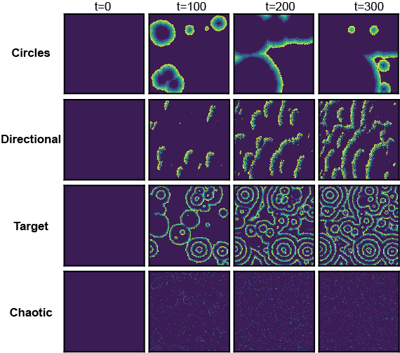
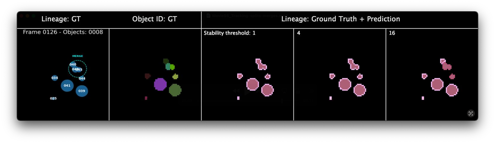
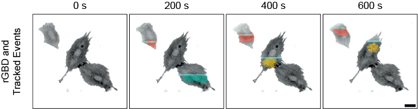
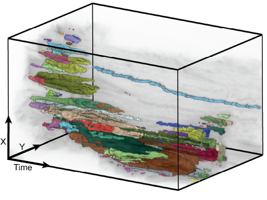
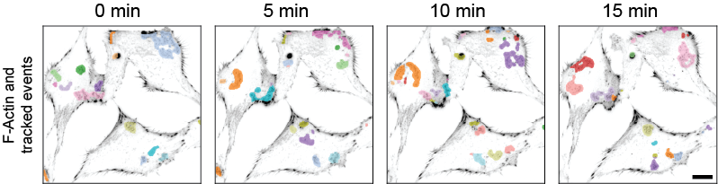
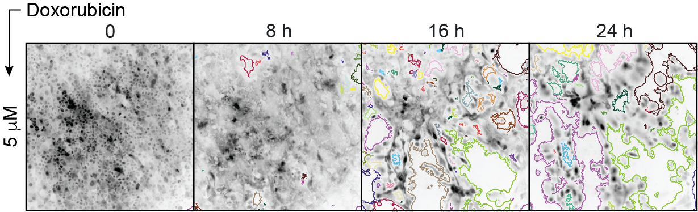

# Introduction

This repository contains scripts required to reproduce the results in the publication of Grädel et al. _Tracking Coordinated Cellular Dynamics in Time-Lapse Microscopy with ARCOS.px_ ([link](https://doi.org/10.1101/2025.03.14.643386)).

  
&nbsp; &nbsp; &nbsp; &nbsp;
   

ARCOS.px is a computational method to identify and track clusters of correlated cell signaling in time-lapse microscopy images. 
It is the latest addition to the [ARCOS ecosystem](https://arcos.gitbook.io/home) developed in the [Cellular Dynamics Lab](https://www.pertzlab.net) at the University of Bern.
ARCOS.px is a [Python software package](https://github.com/bgraedel/arcos4py), and a [dedicated interactive plugin](https://github.com/bgraedel/arcosPx-napari) for the [napari](https://napari.org/stable/) image viewer.

# Scripts

The `scripts` folder contains the following Python scripts and Jupyter notebooks.

## [Wave simulation](scripts/1_wave_simulation)

Python scripts to simulate circular & directional waves, and target & chaotic patterns using cellular automaton.

The scripts reproduce Figure S3 and Movies S1−S5.

## [Tracking of simulated splits and merges](scripts/1_wave_split_merge_sim)

Python scripts to simulate merges and splits.

The scripts reproduce Figure S4A,B and Movie S6.

## [Synthetic RhoA activity wave](scripts/2_synthetic_rhoa_wave)

Python script to analyze optogenetically induced synthetic RhoA activity wave in REF52 cells.
Cells express a RhoA activity sensor 2xrGBD and the optogenetic actuator optoLARG.

The script reproduces Figure 1B,C and Movie S7.

## [Podosome tracking](scripts/3_podosome_tracks)

Python script to track podosomes in REF52 cells; reproduces Figure 2A−D and Movie S8.

R scripts to analyze lineage length and split/merge rate in cells treated with blebbistatin, latrunculin B and Y-27632; reproduce Figures 2E,F & S4C-E, and Movie S9.

## [Polymerization wave](scripts/4_polymerization_wave)

Python script to track active wave-like dynamics in REF52 cells; reproduces Figure 3 and Movie S10.

## [Tracking holes in epithelial monolayer](scripts/5_hole_tracking)

Python script to process images of MCF10A WT epithelial monolayer treated with increasing dosages of Doxorubicin; reproduces Figure 4 and Movie S11.

## [Demo of seed clusters](scripts/6_others)

Python notebook to demonstrate two methods to initiate spatial clusters:

1. A custom clustering function that performs instance segmentation instead of clustering. Arcos then utilises this to track clusters. 
2. Initialise the tracker using a seed image, priming it for specific cluster ID propagation. implemented in the ImageTracker class.

# Data

The `data` folder is a placeholder for files stored on the BioImage Archive due to GitHub's size restrictions. 
Use [this link](https://doi.org/10.6019/S-BIAD1683) to download and unpack the data into that folder.
Once in place, the scripts can process the data and reproduce the figures.
